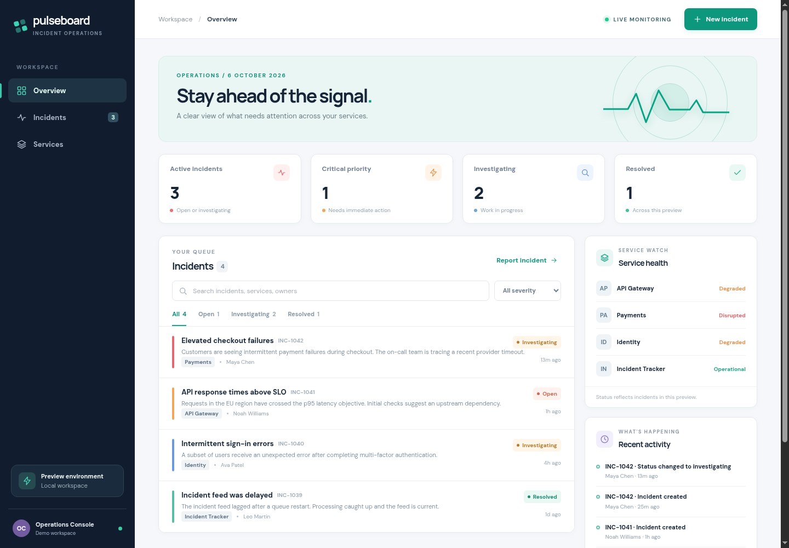

# Crossplane PR Preview Platform

A local portfolio project that turns a trusted GitHub PR into an explained preview environment. The Go evaluator chooses a Kubernetes namespace for app-only changes, a vCluster for a fixed cluster API capability, or a rejection with a reason. Crossplane v2 renders the resources; Argo CD consumes only evaluator-authored GitOps state. Pulseboard, the Incident Tracker app, is the preview workload.

```text
Backstage UI or Codex via Backstage MCP
    -> Scaffolder opens/updates a GitHub PR
    -> GitHub Actions tests and publishes a GHCR image + head-bound artifact
    -> Go watcher validates PR, request, allowed capability, CI, capacity
    -> trusted GitOps repo -> Argo CD ApplicationSet -> Crossplane v2 XR
    -> namespace or vCluster -> Pulseboard URL after health check
    -> merged/closed PR removes XR path -> Argo CD prunes
```

## Current implementation

- Pulseboard has a responsive operations dashboard, seeded incidents, severity and status filters, service health, details, updates, notes, and a JSON API.
- The Go policy is deterministic and tested for namespace, vCluster, rejection, stale CI, invalid image, capacity, TTL expiry, and lifecycle cleanup. The GitHub reader binds the artifact to the exact PR head. The GitOps publisher accepts only evaluator-owned files and can initialize an empty trusted checkout. A watcher and status API are included.
- Crossplane v2 XRD, two Compositions, Go function, provider-helm resources, Argo CD ApplicationSet, Backstage catalog/template and a read-only status action are authored. Both Compositions passed the official CLI renderer with the local Go function and Crossplane v2.4.0 runtime.
- GitHub Actions published the healthy in-cluster Function package `ghcr.io/yashmahakal/function-preview-resources:v0.1.2`. The source repository, Function package, and Pulseboard image are public, so kind can pull them anonymously.
- The dedicated `kind-preview-platform` cluster runs Kubernetes v1.35.0, Crossplane v2.4.0, Argo CD v3.5.2, provider-helm v1.2.0, NGINX ingress, and the custom Function. Two [real GitHub draft PRs](docs/live-pr-verification.md) exercised the watcher, CI artifact verification, trusted GitOps publishing, Argo sync, Crossplane reconciliation, local URLs, and close cleanup in namespace and vCluster modes. Both previews served Pulseboard with HTTP 200 and were removed after their PRs closed. The fixed IncidentPolicy CRD appeared only inside the vCluster. Backstage UI/MCP requests, PR updates, and a merged PR still need end-to-end verification. See [compatibility and feasibility](docs/compatibility.md).



[Mobile preview](docs/screenshots/pulseboard-mobile.png)

## Verify what works offline

```sh
make verify
cd platform/evaluator
go run ./cmd/evaluator -snapshot ../../tests/fixtures/namespace.json -config config.example.json -gitops /tmp/preview-gitops-test
go run ./cmd/evaluator -snapshot ../../tests/fixtures/vcluster.json -config config.example.json -gitops /tmp/preview-gitops-test
go run ./cmd/evaluator -snapshot ../../tests/fixtures/rejected.json -config config.example.json -gitops /tmp/preview-gitops-test
go run ./cmd/evaluator -snapshot ../../tests/fixtures/closed.json -config config.example.json -gitops /tmp/preview-gitops-test
```

Each decision is JSON on stdout. Approved decisions create `previews/<service>-pr-<n>/previewenvironment.json`; the closed fixture removes its XR directory. `status/<name>.json` retains the decision record.

The Composition render fixtures and local function instructions are in [tests/render/README.md](tests/render/README.md). Both render targets passed; the separate [live PR checks](docs/live-pr-verification.md) verified controller behavior with real CI artifacts.

## Optional direct app and ingress smoke check

The temporary `pulseboard-smoke` deployment was removed after the Crossplane-managed previews succeeded. To repeat a direct app smoke check after rebuilding the image:

```sh
docker build -t pulseboard:smoke app/incident-tracker
kind load docker-image pulseboard:smoke --name preview-platform
kubectl --context kind-preview-platform apply -f deploy/local/pulseboard-smoke.yaml
kubectl --context kind-preview-platform rollout status deployment/pulseboard -n pulseboard-smoke
curl --noproxy '*' http://pulseboard-smoke.localhost:8088/healthz
```

Remove the temporary app with `kubectl --context kind-preview-platform delete namespace pulseboard-smoke` when finished.

## Local cluster setup

This path needs Docker, kind v0.31.0, kubectl, Helm, the Crossplane CLI, Go, Node 22, a public GitHub repository, and a separate trusted GitOps repository. Allow enough RAM for Crossplane, Argo CD, the ingress controller, and a vCluster. The commands below are a runbook for a fresh machine; skip `kind create cluster` when `kind-preview-platform` already exists.

This workspace has the dedicated `kind-preview-platform` context and a Ready node. Crossplane, Argo CD, provider-helm, the Function, and NGINX are installed. The two earlier kind clusters were deleted at the operator's request; the Minikube profile was stopped and retained. Select `kind-preview-platform` explicitly when installing or checking controllers.

1. Create the cluster and install controllers:

   ```sh
   kind create cluster --config deploy/local/kind.yaml
   helm repo add crossplane-stable https://charts.crossplane.io/stable
   helm repo update
   helm install crossplane crossplane-stable/crossplane --version 2.4.0 --namespace crossplane-system --create-namespace
   kubectl create namespace argocd
   kubectl apply -n argocd --server-side --force-conflicts -f https://raw.githubusercontent.com/argoproj/argo-cd/v3.5.2/manifests/install.yaml
   helm install nginx-ingress oci://ghcr.io/nginx/charts/nginx-ingress --version 2.7.3 --namespace nginx-ingress --create-namespace --values deploy/local/nginx-ingress-values.yaml
   ```

2. The [Function release workflow](.github/workflows/preview-function.yaml) builds and publishes the package when a `function-v<semver>` tag is pushed; the installed tag is `function-v0.1.2`. Keep the version in [functions.yaml](platform/crossplane/functions.yaml) aligned with that tag. The equivalent local build is:

   ```sh
   cd platform/crossplane/function
   docker build --platform linux/amd64 -t function-preview-runtime:v0.1.2 .
   crossplane xpkg build --package-root=package --embed-runtime-image=function-preview-runtime:v0.1.2 --package-file=/tmp/function-preview-resources.xpkg
   cd ../../..
   ```

   GHCR package visibility is managed separately from repository visibility. Both packages are currently public. If either becomes private, the cluster needs pull credentials for that package; keep credentials outside Git. The release workflow uses the built-in `GITHUB_TOKEN` to publish.

3. Apply Crossplane prerequisites in order. Check that Providers and Functions are healthy before applying Compositions:

   ```sh
   kubectl apply -f platform/crossplane/rbac/composed-resources.yaml
   kubectl apply -f platform/crossplane/provider-helm-runtime.yaml
   kubectl apply -f platform/crossplane/provider-helm.yaml
   kubectl wait --for=condition=healthy provider.pkg.crossplane.io/provider-helm --timeout=5m
   kubectl apply -f platform/crossplane/provider-helm-config.yaml
   kubectl apply -f platform/crossplane/functions.yaml
   kubectl wait --for=condition=healthy function.pkg.crossplane.io/function-preview-resources --timeout=5m
   kubectl apply -f platform/crossplane/xrd.yaml
   kubectl apply -f platform/crossplane/compositions/
   ```

4. Clone the existing **private, separate** `YASHMAHAKAL/preview-gitops` repository into a dedicated local checkout, then run `kubectl apply -f platform/argocd/preview-appset.yaml`. It contains `previews/.gitkeep` and `status/.gitkeep`. The evaluator needs push access through the checkout's Git credential helper. Argo CD needs a read-only deploy key configured as a repository Secret; keep the private key and Secret manifest outside Git. Keep PR source branches out of Argo CD.

5. Set `repository` and `trustedAuthors` in a private copy of [config.example.json](platform/evaluator/config.example.json). The source repository must contain `preview.request.json`, the Incident Tracker code at `app/incident-tracker`, and [preview-image.yaml](.github/workflows/preview-image.yaml). GHCR images must be readable by kind, for example by making the package public. Run the Go watcher and status API:

   ```sh
   cd platform/evaluator
   GITHUB_TOKEN=<read-only-token> go run ./cmd/watcher -config /path/to/config.json -gitops /path/to/preview-gitops
   go run ./cmd/status-api -gitops /path/to/preview-gitops -preview-port 8088
   ```

   The watcher needs GitHub metadata and Actions artifact read access. An anonymous artifact download returned HTTP 401 in the real PR check, even though the source repository is public; supply a token with artifact read access. The GitOps checkout uses your local Git credential helper for its push. Use separate credentials with narrow scopes where possible.

   For each approved **vCluster** preview, once Crossplane creates its host namespace, an operator applies the fixed Helm installer Role and RoleBinding in that namespace. Run this from the repository root, substituting the actual PR number:

   ```sh
   ./deploy/local/bootstrap-vcluster-helm-installer.sh incident-tracker-pr-4244
   ```

   The script verifies an approved `vcluster` XR and its Crossplane-managed namespace before granting `crossplane-system:preview-provider-helm` chart installation permissions there. It is an explicit operator step; the watcher does not yet bootstrap this RBAC automatically. The Role disappears with the namespace during cleanup.

6. The pinned [Backstage portal](platform/backstage/portal) includes the Incident Tracker catalog and request template locations, GitHub Scaffolder action, MCP Actions Backend, and [preview status action](platform/backstage/portal/plugins/preview-backend/src/index.ts). Provide `GITHUB_TOKEN` and a local `MCP_TOKEN`, run the status API, then start the portal. See [Backstage integration](docs/backstage.md) for commands and the current verification boundary.

## Demonstration checks

- Request `app-only` in Backstage UI or via its `scaffolder.execute-template` MCP action. The Go decision should be `namespace`, and the status action should eventually return `http://incident-tracker-pr-<n>.localhost:8088` after `/healthz` succeeds.
- Request `incident-policy`; the fixed CRD file should lead to `vcluster`. Check the CRD exists **inside** the virtual cluster and is absent from the host cluster.
- Edit a disallowed cluster manifest such as a `Node`; the evaluator should report `unsupported-cluster-resource` and write no XR.
- Close or merge the PR. Check the GitOps XR directory, Argo CD Application, XR, host namespace, Helm Release, ingress, and app resources disappear. Do not treat the evaluator's `cleaning` decision alone as proof of resource deletion.

The preview hostname uses `.localhost` and host port 8088. The kind config maps host port 8088 to the ingress controller's NodePort 30080. Port 80 is occupied by another local service. If the host port changes, pass the same value to `status-api -preview-port`.
