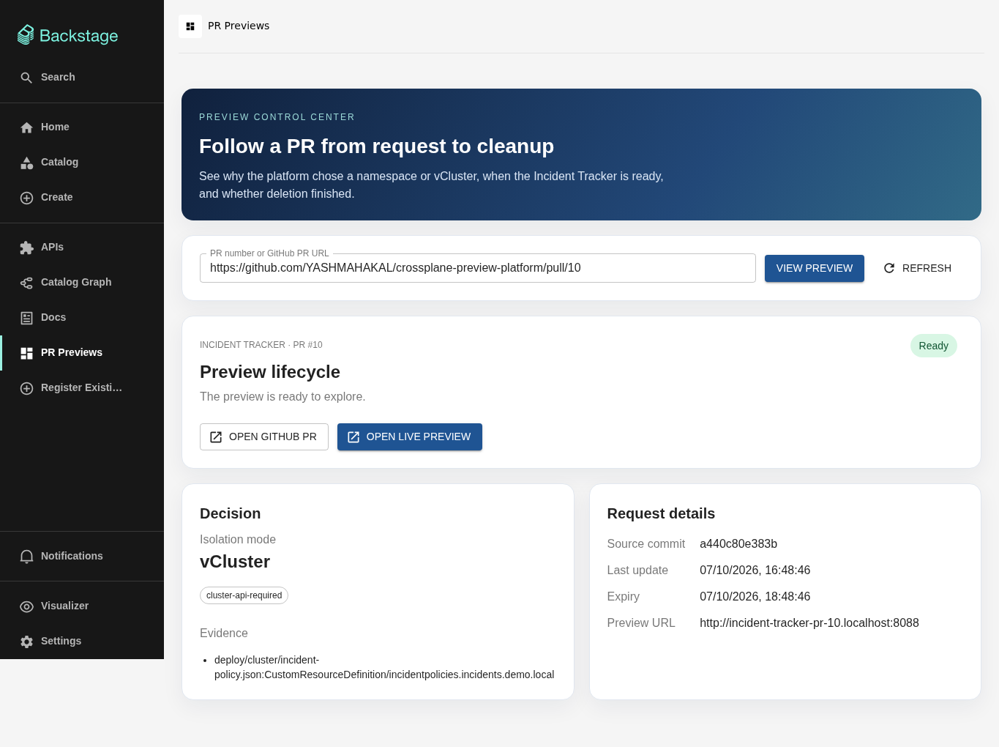

# Crossplane PR Preview Platform

A local portfolio project that turns a trusted GitHub PR into an explained preview environment. The Go evaluator chooses a Kubernetes namespace for app-only changes, a vCluster for a fixed cluster API capability, or a rejection with a reason. Crossplane v2 renders the resources; Argo CD consumes only evaluator-authored GitOps state. Pulseboard, the Incident Tracker app, is the preview workload.

For a repeatable local setup, start with the [setup and verification runbook](docs/local-setup.md): `deploy/local/preflight.sh`, `deploy/local/bootstrap.sh`, `deploy/local/start-portal.sh`, then `deploy/local/verify-platform.sh --portal`. The [short demo guide](docs/demo.md) covers both preview modes and cleanup. The GitHub PR flow needs access to the separate private GitOps repository; offline tests remain available without it.

```text
Developer changes Incident Tracker files and opens/updates a GitHub PR
    -> GitHub Actions tests and publishes a GHCR image + head-bound artifact
    -> Go watcher validates PR, changed files, CI, and capacity
    -> trusted GitOps repo -> Argo CD ApplicationSet -> Crossplane v2 XR
    -> namespace or vCluster -> Pulseboard URL after health check
    -> merged/closed PR or expired TTL removes XR path -> Argo CD prunes
Backstage UI and Codex via Backstage MCP -> catalog discovery and PR status
```

## Current implementation

- Pulseboard has a responsive operations dashboard, seeded incidents, severity and status filters, service health, details, updates, notes, and a JSON API.
- The Go policy is deterministic and tested for namespace, vCluster, rejection, stale CI, invalid image, capacity, TTL expiry, and lifecycle cleanup. The GitHub reader binds the artifact to the exact PR head. The GitOps publisher accepts only evaluator-owned files and can initialize an empty trusted checkout. A watcher and status API are included.
- Crossplane v2 XRD, two Compositions, Go function, provider-helm resources, Argo CD ApplicationSet, Backstage catalog and a read-only status action are authored. Both Compositions passed the official CLI renderer with the local Go function and Crossplane v2.4.0 runtime.
- The current PR workflow automatically previews Incident Tracker app changes in a namespace. Backstage shows the service and preview status; it does not request an isolation mode. The fixed IncidentPolicy CRD remains an allowed vCluster input for a direct PR. General deployment and Crossplane changes are rejected until their evaluation and sandboxing are implemented.
- [PR #16](docs/pr-driven-phase1-verification.md) verified the new automatic app-change flow with a visible UI edit, same-PR head update, Backstage catalog link, and observed close cleanup.
- Approved vCluster requests include a fixed, evaluator-authored installer Role and RoleBinding in trusted GitOps. Argo CD applies the grant in the preview namespace; no manual installer bootstrap is needed. A synthetic run and real Backstage UI PR #10 verified automatic grant, vCluster readiness, HTTP 200, and deletion.
- GitHub Actions published the healthy in-cluster Function package `ghcr.io/yashmahakal/function-preview-resources:v0.1.2`. The source repository, Function package, and Pulseboard image are public, so kind can pull them anonymously.
- The dedicated `kind-preview-platform` cluster runs Kubernetes v1.35.0, Crossplane v2.4.0, Argo CD v3.5.2, provider-helm v1.2.0, NGINX ingress, and the custom Function. [Real GitHub PRs #1–#14](docs/live-pr-verification.md) exercised exact-head CI verification, trusted GitOps publishing, both preview modes, request surfaces, updates, rejection, close and merge cleanup, and TTL recovery. PRs #3–#5 covered Backstage UI, HTTP MCP, and codex3 CLI; PR #6 proved a same-PR update and idempotent replay. PR #7 rejected an unsupported Node manifest without creating a preview. PR #8 created a vCluster from the Backstage UI and kept the IncidentPolicy CRD inside the virtual API. PR #9 removed a namespace preview after merge. PR #10 proved the Backstage status page, its task deep link, and the automatic vCluster installer grant on a real PR. PRs #11–#14 produced the reliability findings and measurements documented below. All thirteen approved previews served `/healthz` before their resources were removed after close, merge, or TTL expiry. See [compatibility and feasibility](docs/compatibility.md).


[Mobile preview](docs/screenshots/pulseboard-mobile.png)



## Verify what works offline

```sh
make verify
cd platform/evaluator
go run ./cmd/evaluator -snapshot ../../tests/fixtures/namespace.json -config config.example.json -gitops /tmp/preview-gitops-test
go run ./cmd/evaluator -snapshot ../../tests/fixtures/vcluster.json -config config.example.json -gitops /tmp/preview-gitops-test
go run ./cmd/evaluator -snapshot ../../tests/fixtures/rejected.json -config config.example.json -gitops /tmp/preview-gitops-test
go run ./cmd/evaluator -snapshot ../../tests/fixtures/closed.json -config config.example.json -gitops /tmp/preview-gitops-test
```

Each decision is JSON on stdout. Approved decisions create `previews/<service>-pr-<n>/previewenvironment.json`; the closed fixture removes its XR directory. `status/<name>.json` retains the decision record.

The Composition render fixtures and local function instructions are in [tests/render/README.md](tests/render/README.md). Both render targets passed; the separate [live PR checks](docs/live-pr-verification.md) verified controller behavior with real CI artifacts.

The [reliability evaluation](docs/reliability-evaluation.md) records raw timing and the failure cases that led to a stricter XR-plus-route readiness check, idempotent cleanup, and supervised watcher services. A Go observer at `platform/evaluator/cmd/preview-eval` produces timestamped JSON samples. TTL and close cleanup depend on the watcher; the local service installer below keeps it running under the user's systemd manager.

## Optional direct app and ingress smoke check

The temporary `pulseboard-smoke` deployment was removed after the Crossplane-managed previews succeeded. To repeat a direct app smoke check after rebuilding the image:

```sh
docker build -t pulseboard:smoke app/incident-tracker
kind load docker-image pulseboard:smoke --name preview-platform
kubectl --context kind-preview-platform apply -f deploy/local/pulseboard-smoke.yaml
kubectl --context kind-preview-platform rollout status deployment/pulseboard -n pulseboard-smoke
curl --noproxy '*' http://pulseboard-smoke.localhost:8088/healthz
```

Remove the temporary app with `kubectl --context kind-preview-platform delete namespace pulseboard-smoke` when finished.

## Local cluster setup

This path needs Docker, kind, kubectl, Helm, the Crossplane CLI, Go, Node 22 or 24, a public GitHub repository, and a separate trusted GitOps repository. Allow enough RAM for Crossplane, Argo CD, the ingress controller, and a vCluster. Use the [checked setup path](docs/local-setup.md) first; the commands below expose the underlying manual steps. The last tested kind CLI was v0.33.0.

This workspace has the dedicated `kind-preview-platform` context and a Ready node. Crossplane, Argo CD, provider-helm, the Function, and NGINX are installed. The two earlier kind clusters were deleted at the operator's request; the Minikube profile was stopped and retained. Select `kind-preview-platform` explicitly when installing or checking controllers.

1. Create the cluster and install controllers:

   ```sh
   kind create cluster --config deploy/local/kind.yaml
   helm repo add crossplane-stable https://charts.crossplane.io/stable
   helm repo update
   helm install crossplane crossplane-stable/crossplane --version 2.4.0 --namespace crossplane-system --create-namespace
   kubectl create namespace argocd
   kubectl apply -n argocd --server-side --force-conflicts -f https://raw.githubusercontent.com/argoproj/argo-cd/v3.5.2/manifests/install.yaml
   helm install nginx-ingress oci://ghcr.io/nginx/charts/nginx-ingress --version 2.7.3 --namespace nginx-ingress --create-namespace --values deploy/local/nginx-ingress-values.yaml
   ```

2. The [Function release workflow](.github/workflows/preview-function.yaml) builds and publishes the package when a `function-v<semver>` tag is pushed; the installed tag is `function-v0.1.2`. Keep the version in [functions.yaml](platform/crossplane/functions.yaml) aligned with that tag. The equivalent local build is:

   ```sh
   cd platform/crossplane/function
   docker build --platform linux/amd64 -t function-preview-runtime:v0.1.2 .
   crossplane xpkg build --package-root=package --embed-runtime-image=function-preview-runtime:v0.1.2 --package-file=/tmp/function-preview-resources.xpkg
   cd ../../..
   ```

   GHCR package visibility is managed separately from repository visibility. Both packages are currently public. If either becomes private, the cluster needs pull credentials for that package; keep credentials outside Git. The release workflow uses the built-in `GITHUB_TOKEN` to publish.

3. Apply Crossplane prerequisites in order. Check that Providers and Functions are healthy before applying Compositions:

   ```sh
   kubectl apply -f platform/crossplane/rbac/composed-resources.yaml
   kubectl apply -f platform/crossplane/provider-helm-runtime.yaml
   kubectl apply -f platform/crossplane/provider-helm.yaml
   kubectl wait --for=condition=healthy provider.pkg.crossplane.io/provider-helm --timeout=5m
   kubectl apply -f platform/crossplane/provider-helm-config.yaml
   kubectl apply -f platform/crossplane/functions.yaml
   kubectl wait --for=condition=healthy function.pkg.crossplane.io/function-preview-resources --timeout=5m
   kubectl apply -f platform/crossplane/xrd.yaml
   kubectl apply -f platform/crossplane/compositions/
   ```

4. Clone the existing **private, separate** `YASHMAHAKAL/preview-gitops` repository into a dedicated local checkout, then run `kubectl apply -f platform/argocd/preview-appset.yaml`. It contains `previews/.gitkeep` and `status/.gitkeep`. The evaluator needs push access through the checkout's Git credential helper. Argo CD needs a read-only deploy key configured as a repository Secret; keep the private key and Secret manifest outside Git. Keep PR source branches out of Argo CD.

5. Set `repository`, `trustedAuthors`, and bounded preview defaults in a private copy of [config.example.json](platform/evaluator/config.example.json). The source repository must contain the Incident Tracker code at `app/incident-tracker` and [preview-image.yaml](.github/workflows/preview-image.yaml). GHCR images must be readable by kind, for example by making the package public. On this Linux host, install the supervised Go watcher and status API after `gh auth login` and SSH access to the separate GitOps repository are configured:

   ```sh
   deploy/local/install-preview-services.sh
   deploy/local/preview-service-health.sh
   journalctl --user -u preview-watcher -u preview-status-api -f
   ```

   The installer builds Go binaries, clones the private GitOps repository into `~/.local/share/crossplane-preview-platform/preview-gitops`, and installs user units under `~/.config/systemd/user`. Its heartbeat is in `~/.local/state/crossplane-preview-platform/watcher-health.json`, outside Git. The watcher obtains the existing `gh` credential at service start; no token is committed or written into a unit. To use a private config, set `PREVIEW_CONFIG=/absolute/path/config.json` in a systemd user drop-in for `preview-watcher.service`, then reload and restart it. The installer rejects a dirty or divergent GitOps checkout instead of resetting it. `GET http://127.0.0.1:8090/healthz` reports the last successful reconciliation and returns 503 after a failed pass or three minutes without one. The health script also checks both systemd units, so it detects a stopped watcher immediately. User services persist across Codex sessions while this user's systemd manager is running; this host has `Linger=no`, so an all-user logout stops them. Restart the services after login, or enable user lingering separately if unattended operation across logout is needed.

   For a one-off/manual run, use:

   ```sh
   cd platform/evaluator
   GITHUB_TOKEN=<read-only-token> go run ./cmd/watcher -config /path/to/config.json -gitops /path/to/preview-gitops -kube-context kind-preview-platform -preview-port 8088 -health-file /path/to/watcher-health.json
   go run ./cmd/status-api -gitops /path/to/preview-gitops -kube-context kind-preview-platform -preview-port 8088 -watcher-health-file /path/to/watcher-health.json
   ```

   The watcher needs GitHub metadata and Actions artifact read access. An anonymous artifact download returned HTTP 401 in the real PR check, even though the source repository is public; supply a token with artifact read access. It also needs read access to the named Kubernetes context to verify cleanup, plus access to the local ingress port. The GitOps checkout uses your local Git credentials for its push. Use separate credentials with narrow scopes where possible.

   For an approved **vCluster** preview, the evaluator also writes two fixed installer-grant manifests beside the XR in trusted GitOps. Argo CD retries their sync until Crossplane creates the preview namespace. The grant is namespaced and disappears with that namespace after provider-helm uninstalls the Release. The older [manual bootstrap script](deploy/local/bootstrap-vcluster-helm-installer.sh) remains only as a recovery tool; routine requests need no operator grant step.

6. The pinned [Backstage portal](platform/backstage/portal) includes the Incident Tracker catalog, MCP Actions Backend, [preview status action](platform/backstage/portal/plugins/preview-backend/src/index.ts), and a **PR Previews** page. Provide `GITHUB_TOKEN` and a local `MCP_TOKEN`, run the status API, then start the portal. Enter a source PR number to inspect its status. See [Backstage integration](docs/backstage.md) for commands and verification.

## Demonstration checks

- Change an Incident Tracker app file and open a source PR. The Go decision should be `namespace`, and the status action should eventually return `http://incident-tracker-pr-<n>.localhost:8088` after `/healthz` succeeds.
- Open a direct PR with the exact allowlisted IncidentPolicy CRD file; it should lead to `vcluster`. Check the CRD exists **inside** the virtual cluster and is absent from the host cluster.
- Edit a disallowed cluster manifest such as a `Node`; the evaluator should report `unsupported-cluster-resource` and write no XR.
- Close or merge the PR, or let its TTL expire. The watcher publishes removal, checks the Argo CD Application, XR, host namespace, persistent volumes, and local route, then reports `deleted` after a 30-second settle period. A blocked check or remaining resource becomes `cleanup-failed` after ten minutes and is retried. `pr-closed`, `pr-merged`, and `ttl-expired` identify the trigger; inspect the status evidence for any failed cleanup. The status API hides the URL at the TTL deadline even if the watcher is temporarily stopped; actual resource removal still requires a running watcher and controllers.

The preview hostname uses `.localhost` and host port 8088. The kind config maps host port 8088 to the ingress controller's NodePort 30080. Port 80 is occupied by another local service. If the host port changes, pass the same value to `status-api -preview-port`.
