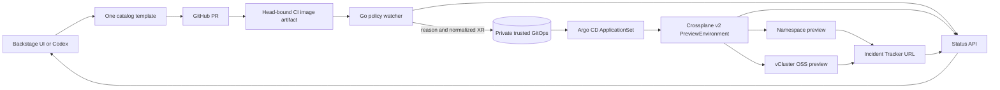

# PR preview platform demo

This is a short, repeatable walkthrough for a portfolio review. Complete the [local setup](local-setup.md) first, keep `deploy/local/start-portal.sh` running, and run `deploy/local/verify-platform.sh --portal`. Have source PR write access and no other active previews so the configured capacity limit does not reject the request.

## Live sequence

1. **Discover the service.** Open `http://localhost:3000`, select Incident Tracker in the catalog, and open **Request a preview**. Show the accepted inputs: request ID, repository, size, TTL, and capability. In Codex, ask what the service accepts; it uses the same catalog and template through Backstage MCP.
2. **Request a namespace preview.** Choose `app-only`, `small`, and a short bounded TTL. Backstage creates a PR. Show the `Preview image` check for the PR head and the task's **Track preview status** link. The status first waits for CI, then explains `namespace`/`namespaced-app-change`, and finally shows the live URL after Crossplane and the app are ready. Run `deploy/local/verify-preview.sh <PR> namespace`, then open Pulseboard and change an incident status.
3. **Show the policy decision.** Point out that the GitOps repository contains a normalized XR authored by the watcher. Argo CD watches that private repository, never the PR branch. The status page shows the reason, source SHA, expiry, and observed state.
4. **Request a vCluster preview.** Use a new request ID with `incident-policy`. The fixed CRD is the supported cluster API need. The evaluator should explain `vcluster`/`cluster-api-required`. Run `deploy/local/verify-preview.sh <PR> vcluster`; show the app's vCluster context and confirm the IncidentPolicy CRD is absent from the host API. Earlier [live evidence](live-pr-verification.md) includes the virtual API check.
5. **Clean up.** Close each test PR. Wait for `deleted`/`cleanup-verified`, run `deploy/local/verify-preview.sh <PR> deleted`, and show the URL now returns 404. The [reliability evaluation](reliability-evaluation.md) includes a real five-minute TTL outage/restart trial, not just a happy-path close.

The live request portions create GitHub PRs and GHCR images, so use them only in the configured source repository and close the demo PRs when finished. The setup and verification scripts themselves are read-only with respect to source PRs. Do not present a single local run as a production availability or p95 performance claim; the measurements report individual samples and the user-session dependency of the local watcher.
