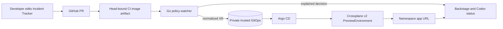

# PR-driven preview demo

Complete [local setup](local-setup.md), keep `deploy/local/start-portal.sh` running, and run `deploy/local/verify-platform.sh --portal`. Have source PR write access and capacity for a preview.

## Live namespace sequence

1. Create a branch from `main`, change a visible string or style in `app/incident-tracker/`, push it, and open a source PR. Do not add `preview.request.json` or select an environment type.
2. Wait for the `Preview image` run for the PR's current head. Enter the PR number in Backstage **PR Previews**, or use Codex `preview.get-status`. The watcher should explain `namespace` and `namespaced-app-change` with the changed path.
3. Wait for `ready`, run `deploy/local/verify-preview.sh <PR> namespace`, and open the displayed URL. Confirm the actual app edit appears. The trusted GitOps repository should contain a normalized XR, never the raw PR manifest.
4. Close the PR. Wait for `deleted` and `cleanup-verified`, then run `deploy/local/verify-preview.sh <PR> deleted` to check Argo, XR, namespace, volume, and route cleanup.

For a deployment preview, change `spec.replicas` in [the bounded deployment config](deployment-preview.md) from `1` to `2` in another PR. The watcher should explain `namespace`/`namespaced-deployment-change`; verify the live route and two namespaced Deployment replicas, then close and verify cleanup. A direct PR containing the exact allowlisted IncidentPolicy CRD in `deploy/cluster/` exercises the vCluster path; mixing that CRD and bounded deployment settings also selects vCluster. Other deployment and Crossplane edits are rejected while their evaluation paths are being built. The [historical live evidence](live-pr-verification.md) covers both modes under the earlier request-template flow.

Live demos create source PRs and GHCR images. Close demo PRs when finished. The local watcher requires the user's systemd manager and cluster to remain available; the [reliability evaluation](reliability-evaluation.md) reports individual samples rather than production availability claims.
